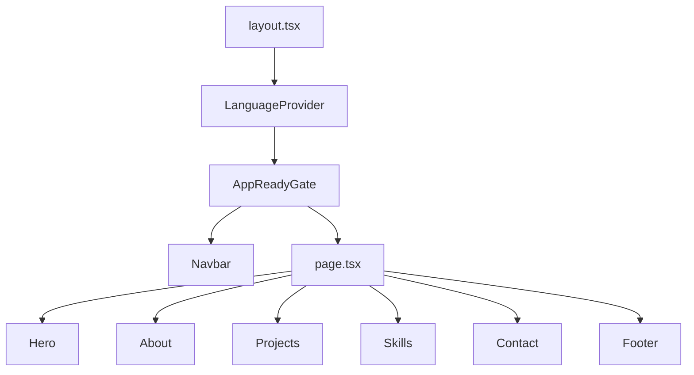
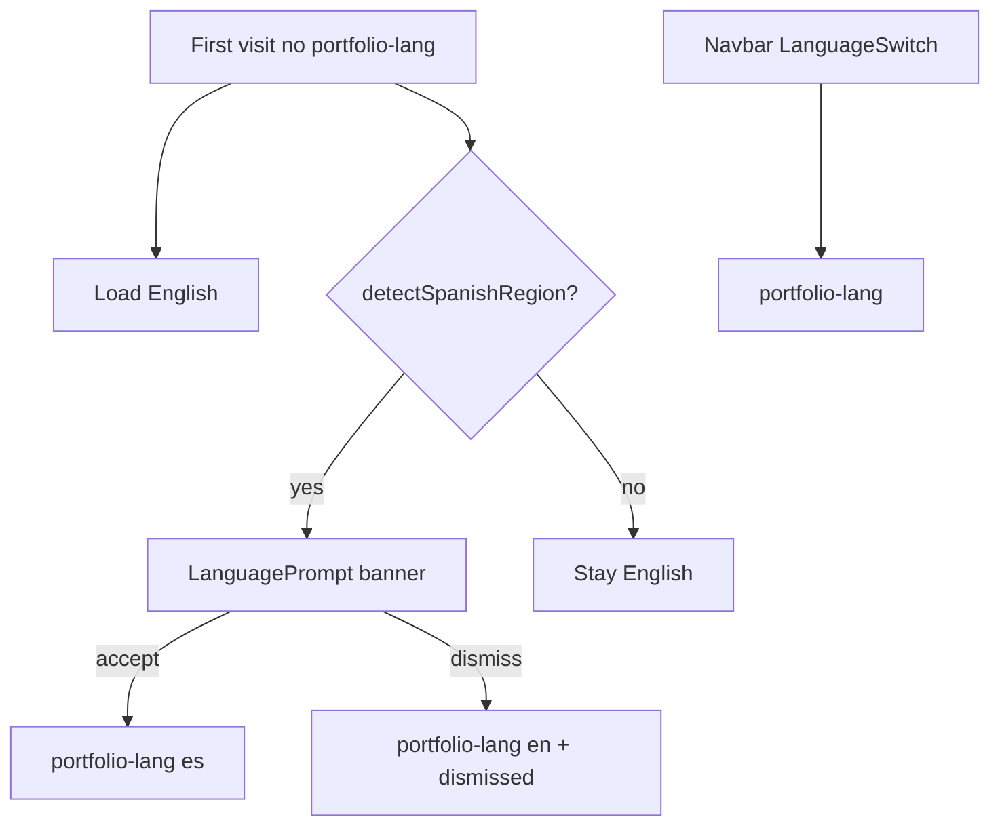

# Architecture — Portfolio JME

Single-page personal portfolio built with **Next.js 16** (App Router), **React 19**, **TypeScript**, and **GSAP**.

## Repository structure

```
portfolio/
├── public/
│   ├── cv/                       # CV PDF for About download CTA
│   └── screenshots/              # Project screenshots (.webp or .png)
├── docs/                       # Technical documentation
├── src/
│   ├── app/
│   │   ├── layout.tsx          # Root layout, metadata, providers
│   │   ├── page.tsx            # Home (sections)
│   │   ├── loading.tsx         # Route loading UI
│   │   └── globals.css         # Tokens and global reset
│   ├── components/
│   │   ├── common/             # Navbar, Footer, loading primitives
│   │   └── sections/           # Hero, About, Projects, Skills, Contact
│   ├── data/
│   │   └── projects.ts         # Static project data
│   ├── lib/
│   │   ├── i18n/               # Context + ES/EN translations + localeUtils
│   │   ├── theme/              # themeUtils + useTheme (auto/manual)
│   │   ├── hooks/              # useFocusTrap, useModalLock
│   │   └── motion/             # prefersReducedMotion
│   └── types/
└── AGENTS.md                   # AI agent rules
```

## Rendering flow



## Layers

| Layer | Responsibility |
| ----- | -------------- |
| `app/` | Routing, SEO metadata, global layout |
| `components/sections/` | Landing sections (client components with GSAP) |
| `components/common/` | Shared UI (navbar, footer, skeleton, spinner) |
| `data/` | Typed static content (projects) |
| `lib/i18n/` | Internationalisation via React Context |

## Internationalisation

- Context: [`LanguageContext.tsx`](../src/lib/i18n/LanguageContext.tsx)
- Translations: `es.ts` + `en.ts` (shared `Translations` interface)
- Spanish region detection: [`localeUtils.ts`](../src/lib/i18n/localeUtils.ts)
- Suggestion banner: [`LanguagePrompt.tsx`](../src/components/common/LanguagePrompt/LanguagePrompt.tsx)
- First visit default: **English** (`portfolio-lang` absent)
- Persistence: `portfolio-lang`, `portfolio-lang-prompt-dismissed`
- Inline script in layout syncs `lang` on `<html>` before paint



## Project data

[`projects.ts`](../src/data/projects.ts) exports a typed `Project[]` array:

- `id`, `title`, `description` (Record ES/EN), `stack`, `githubUrl`, `screenshots`, `color`
- The preview modal reads screenshots and description according to the active language
- Screenshots in `public/screenshots/` named `{id}-{n}.webp` or `{id}-{n}.png` (both formats supported)
- Gallery: `object-fit: contain` + letterbox; lightbox with internal controls; click on slide expands

## Skills

[`Skills.tsx`](../src/components/sections/Skills/Skills.tsx) defines `SKILL_CATEGORIES` (literal chips, not i18n). Categories: `languages`, `frontend`, `backend`, `tools`. Category labels via `t.skills.categories.*`. Source of truth for the stack: Tech Stack section of the author's GitHub README.

## GSAP

- Plugin: `@gsap/react` (`useGSAP`) with scope per section
- `ScrollTrigger` for viewport entry animations
- Plugin registration in each component that uses them (`typeof window !== 'undefined'`)
- Automatic cleanup via `useGSAP` context

## Themes

- Auto by default: **light** 07:00–19:00, **dark** otherwise (browser local time)
- Navbar toggle → `manual` mode + `data-theme` on `<html>`
- Utilities: [`themeUtils.ts`](../src/lib/theme/themeUtils.ts), hook [`useTheme.ts`](../src/lib/theme/useTheme.ts)
- Persistence: `portfolio-theme-mode` (`auto` \| `manual`), `portfolio-theme` (`light` \| `dark`)
- Inline script in layout replicates logic before paint
- In `auto` mode, `useTheme` recalculates every 60s when crossing day/night

## Deploy

- Target: [Vercel](https://vercel.com)
- Production URL: `https://julianmeoficial.vercel.app`
- Build: `npm run build` → static/SSR output per Next.js configuration
