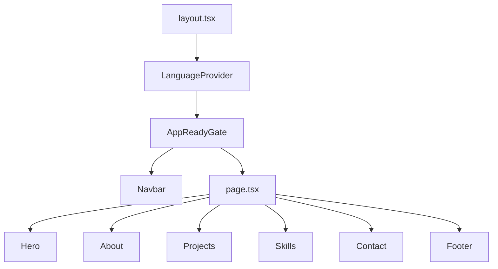
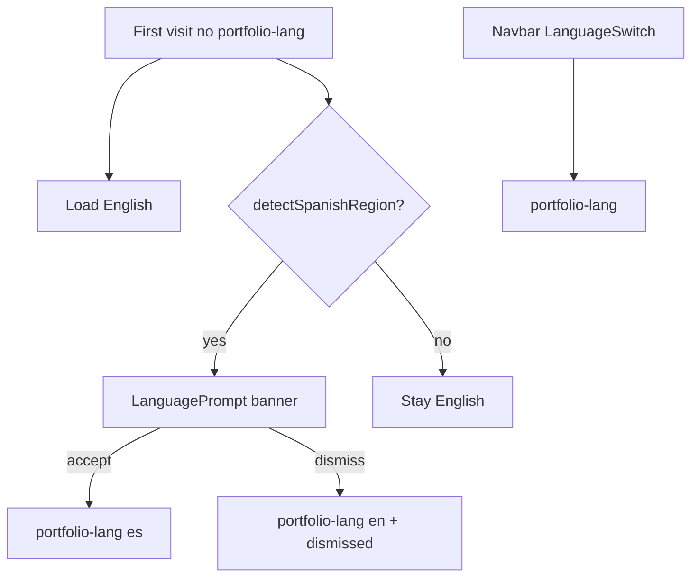

# Arquitectura — Portfolio JME

Portfolio personal single-page construido con **Next.js 16** (App Router), **React 19**, **TypeScript** y **GSAP**.

## Estructura del repositorio

```
portfolio/
├── public/
│   └── screenshots/          # Capturas de proyectos (.webp)
├── docs/                       # Documentación técnica
├── src/
│   ├── app/
│   │   ├── layout.tsx          # Root layout, metadata, providers
│   │   ├── page.tsx            # Home (secciones)
│   │   ├── loading.tsx         # Loading UI de ruta
│   │   └── globals.css         # Tokens y reset global
│   ├── components/
│   │   ├── common/             # Navbar, Footer, loading primitives
│   │   └── sections/           # Hero, About, Projects, Skills, Contact
│   ├── data/
│   │   └── projects.ts         # Datos estáticos de proyectos
│   ├── lib/
│   │   ├── i18n/               # Context + traducciones ES/EN + localeUtils
│   │   ├── theme/              # themeUtils + useTheme (auto/manual)
│   │   ├── hooks/              # useFocusTrap, useModalLock
│   │   └── motion/             # prefersReducedMotion
│   └── types/
└── AGENTS.md                   # Reglas para agentes IA
```

## Flujo de renderizado



## Capas

| Capa | Responsabilidad |
| ---- | --------------- |
| `app/` | Routing, metadata SEO, layout global |
| `components/sections/` | Secciones de la landing (client components con GSAP) |
| `components/common/` | UI compartida (navbar, footer, skeleton, spinner) |
| `data/` | Contenido estático tipado (proyectos) |
| `lib/i18n/` | Internacionalización vía React Context |

## Internacionalización

- Context: [`LanguageContext.tsx`](../src/lib/i18n/LanguageContext.tsx)
- Traducciones: `es.ts` + `en.ts` (misma interfaz `Translations`)
- Detección región ES: [`localeUtils.ts`](../src/lib/i18n/localeUtils.ts)
- Banner sugerencia: [`LanguagePrompt.tsx`](../src/components/common/LanguagePrompt/LanguagePrompt.tsx)
- Default primera visita: **inglés** (`portfolio-lang` ausente)
- Persistencia: `portfolio-lang`, `portfolio-lang-prompt-dismissed`
- Script inline en layout sincroniza `lang` en `<html>` antes del paint



## Datos de proyectos

[`projects.ts`](../src/data/projects.ts) exporta un array tipado `Project[]`:

- `id`, `title`, `description` (Record ES/EN), `stack`, `githubUrl`, `screenshots`, `color`
- El modal de preview lee screenshots y descripción según idioma activo

## GSAP

- Plugin: `@gsap/react` (`useGSAP`) con scope por sección
- `ScrollTrigger` para animaciones al entrar en viewport
- Registro de plugins en cada componente que los usa (`typeof window !== 'undefined'`)
- Cleanup automático vía `useGSAP` context

## Temas

- Auto por defecto: **light** 07:00–19:00, **dark** resto (hora local del navegador)
- Toggle en Navbar → modo `manual` + `data-theme` en `<html>`
- Utilidades: [`themeUtils.ts`](../src/lib/theme/themeUtils.ts), hook [`useTheme.ts`](../src/lib/theme/useTheme.ts)
- Persistencia: `portfolio-theme-mode` (`auto` \| `manual`), `portfolio-theme` (`light` \| `dark`)
- Script inline en layout replica la lógica antes del paint
- En modo `auto`, `useTheme` recalcula cada 60s al cruzar día/noche

## Deploy

- Target: [Vercel](https://vercel.com)
- URL producción: `https://julianmeoficial.vercel.app`
- Build: `npm run build` → output estático/SSR según configuración Next.js
