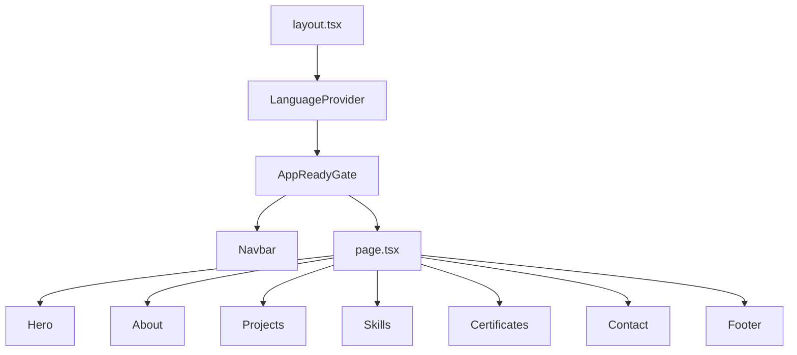

# Architecture — Portfolio JME

Single-page personal portfolio built with **Next.js 16** (App Router), **React 19**, **TypeScript**, and **GSAP**.

For contribution workflow and adding projects, see [CONTRIBUTING.md](CONTRIBUTING.md).

## Repository structure

```
portfolio/
├── public/
│   ├── cv/                         # CV PDF for About download CTA
│   ├── certificates/               # Certificate PDFs for Certificates deck
│   └── screenshots/                # Project screenshots (.webp or .png)
├── docs/                           # Technical documentation (see docs/README.md)
├── src/
│   ├── app/
│   │   ├── layout.tsx              # Root layout, metadata, providers
│   │   ├── page.tsx                # Home (sections)
│   │   ├── loading.tsx             # Route loading UI
│   │   └── globals.css             # Tokens and global reset
│   ├── components/
│   │   ├── common/                 # Navbar, Footer, loading primitives
│   │   └── sections/               # Hero, About, Projects, Skills, Certificates, Contact
│   ├── data/
│   │   ├── projects.ts             # Static project data
│   │   └── certificates.ts         # Static certificate metadata (PDFs in public/)
│   ├── lib/
│   │   ├── i18n/                   # Context + ES/EN translations + localeUtils
│   │   ├── theme/                  # themeUtils + useTheme (auto/manual)
│   │   ├── hooks/                  # useFocusTrap, useModalLock
│   │   └── motion/                 # prefersReducedMotion
│   └── types/
├── AGENTS.md                       # AI agent rules
└── README.md                       # Project entry point
```

## Rendering flow



## Layers

| Layer | Responsibility |
| ----- | -------------- |
| `app/` | Routing, SEO metadata, global layout |
| `components/sections/` | Landing sections (client components with GSAP) |
| `components/common/` | Shared UI (navbar, footer, skeleton, spinner) |
| `data/` | Typed static content (projects, certificates) |
| `lib/i18n/` | Internationalisation via React Context |

## Internationalisation

See [I18N.md](I18N.md) for the full guide (adding keys, banner behaviour, rules).

- Context: [`LanguageContext.tsx`](../src/lib/i18n/LanguageContext.tsx)
- Translations: `es.ts` + `en.ts` (shared `Translations` interface)
- First visit default: **English** (`portfolio-lang` absent)
- Persistence: `portfolio-lang`, `portfolio-lang-prompt-dismissed`
- Inline script in layout syncs `lang` on `<html>` before paint

## Project data

[`projects.ts`](../src/data/projects.ts) exports a typed `Project[]` array:

- `id`, `title`, `description` (Record ES/EN), `stack`, `githubUrl`, `screenshots`, `color`
- The preview modal reads screenshots and description according to the active language
- Screenshots in `public/screenshots/` named `{id}-{n}.webp` or `{id}-{n}.png` (both formats supported)
- Gallery: `object-fit: contain` + letterbox; lightbox with internal controls; click on slide expands

## Skills

[`Skills.tsx`](../src/components/sections/Skills/Skills.tsx) defines `SKILL_CATEGORIES` (literal chips, not i18n). Categories: `languages`, `frontend`, `backend`, `tools`. Category labels via `t.skills.categories.*`. Source of truth for the stack: Tech Stack section of the author's GitHub README.

## Certificates

[`certificates.ts`](../src/data/certificates.ts) exports a typed `Certificate[]` array (empty until entries are added):

- `id`, `title`, `issuer`, `category`, `track`, `pdf`, `verificationUrl`, optional `issuedAt`
- Optional specialization fields: `description` (Record ES/EN) and `courseCount` (e.g. Coursera specializations)
- Categories: `coursera` | `aws` | `google` | `meta` | `other` — filter chips appear once entries exist
- Tracks: `it` | `language` | `other` — internal deck sort only (IT → language → other, then newest `issuedAt`); not shown in the UI
- `sortCertificates` / `filterCertificatesByCategory` always return the ordered list; source array order does not matter
- PDFs live in `public/certificates/` (e.g. `/certificates/{id}.pdf`)
- Metadata stays in `certificates.ts` — same split as screenshots vs `projects.ts`
- UI: swipe deck in [`Certificates.tsx`](../src/components/sections/Certificates/Certificates.tsx) — each slide pairs metadata + PDF preview; category filters, click/drag navigation, dots, [`PdfLightbox`](../src/components/sections/Certificates/PdfLightbox.tsx) for expanded view; empty state when the array is empty

## GSAP

- Plugin: `@gsap/react` (`useGSAP`) with scope per section
- `ScrollTrigger` for viewport entry animations
- Plugin registration in each component that uses them (`typeof window !== 'undefined'`)
- Automatic cleanup via `useGSAP` context

## Themes

- Auto by default: **light** 07:00–19:00, **dark** otherwise (local hour via `Intl` timezone)
- Navbar toggle → `manual` mode + `data-theme` on `<html>`; double-click toggle restores `auto`
- Utilities: [`themeUtils.ts`](../src/lib/theme/themeUtils.ts), hook [`useTheme.ts`](../src/lib/theme/useTheme.ts)
- Persistence: `portfolio-theme-mode` (`auto` \| `manual`), `portfolio-theme` (`light` \| `dark`)
- Inline script in layout replicates logic before paint (including `Intl` hour resolution)
- In `auto` mode, `useTheme` recalculates every 60s when crossing day/night

## Deploy

- Target: [Vercel](https://vercel.com)
- Production URL: `https://julianmeoficial.vercel.app`
- Build: `npm run build` → static output per Next.js configuration

Workflow and checklist: [CONTRIBUTING.md](CONTRIBUTING.md#deploy-vercel).
